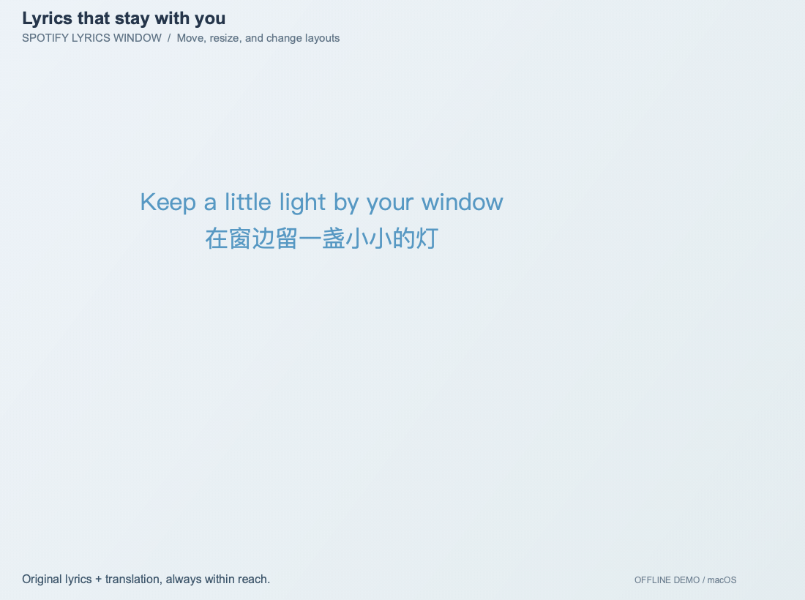
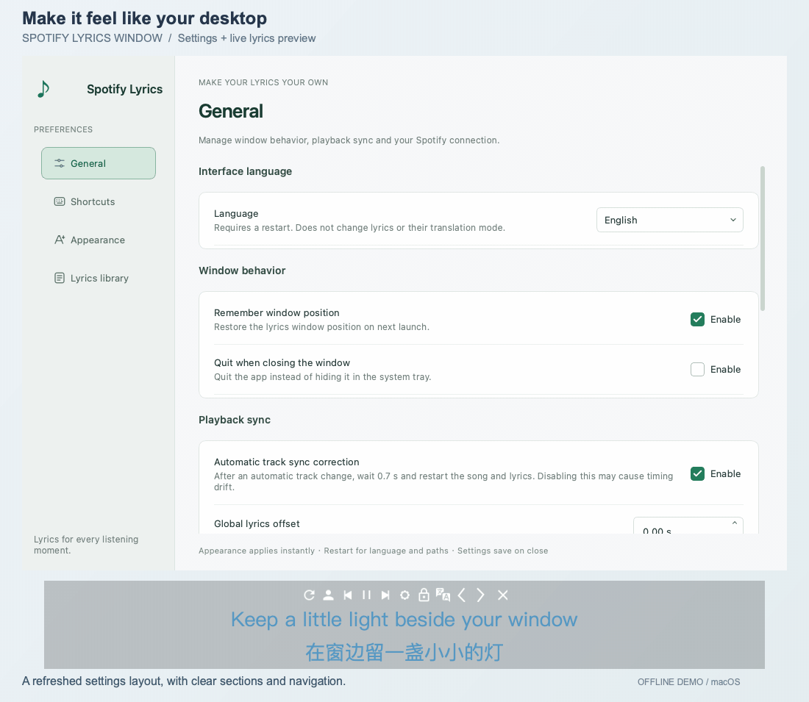
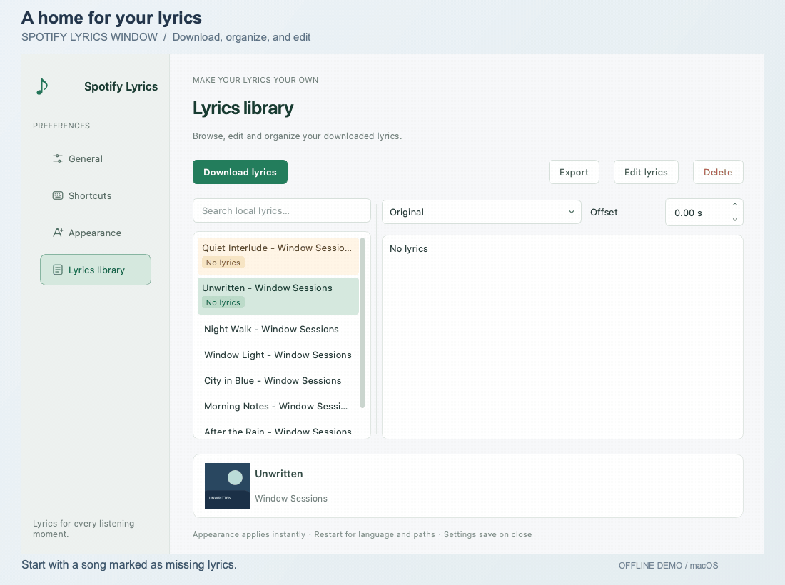

# Spotify Lyrics Window 🎵

一个面向 Spotify 的桌面悬浮歌词窗口，支持实时滚动歌词、播放控制、本地歌词管理与样式自定义。

[English README](./README.en.md)

## 👀 项目预览

以下使用当前 UI 在 macOS 上录制，采用英文界面和自编演示歌词，不连接真实播放会话。下载演示使用离线歌词源响应，搜索、选择与本地保存走实际程序流程。可在设置中切换中文 / English，重启生效。

歌词展示：拖动窗口、拉伸与缩小（字号随尺寸变化）、长句滚动，以及按 Unicode 规则排版的横竖切换。



新版设置：侧栏导航、快捷键、字体与配色，样式调整即时反映到歌词窗口。



歌词管理：为无歌词曲目搜索并下载歌词，保存后清除状态标记；也可搜索本地曲目、编辑保存、调整偏移与查看翻译。



## 📖 项目简介

`Spotify Lyrics Window` 是一个基于 `PyQt6` 的桌面歌词工具，目标是为 Spotify 提供更自由、更接近桌面原生体验的悬浮歌词窗口。

相比只展示歌词的简单脚本，这个项目提供了更完整的桌面使用体验：

- 播放时自动切歌与滚动
- 播放控制联动
- 多歌词源匹配与下载
- 本地歌词缓存与管理
- 支持窗口样式、字体、颜色、快捷键等自定义

## ✨ 功能亮点

- Spotify 桌面悬浮歌词窗口
- 歌词自动滚动与自动切换
- 支持播放、暂停、上一首、下一首
- 多歌词来源：酷狗、网易云、Spotify
- 本地歌词缓存与歌词文件管理
- 歌词搜索、无歌词状态标记、编辑与单曲时间偏移
- 支持翻译歌词显示
- 横向 / 纵向歌词显示模式
- 竖排按 Unicode 字符方向处理混排，保留组合重音与 Emoji
- 支持字体、颜色、阴影、窗口样式自定义
- 支持全局快捷键
- 自动切歌同步修正开关、全局与单曲歌词偏移
- 侧栏式设置界面，支持简体中文 / English
- 支持 Windows、Linux 与 macOS（Spotify 桌面客户端）媒体会话

## 💡 为什么做这个项目

Spotify 在桌面端的歌词体验仍然有不少可以改进的地方，这个项目主要希望解决这些问题：

- 听歌时不需要频繁切回主播放器看歌词
- 浮窗歌词更适合边工作边听歌的桌面场景
- 多歌词源可以提高歌词匹配成功率
- 本地歌词管理可以让歌词体验更稳定、可控
- 自定义能力更适合长期使用

## 🧱 项目结构

```text
SpotifyLyricWindow/
├─ common/        # 配置、歌词逻辑、API 客户端、媒体会话、播放器
│  ├─ macos/      # macOS 窗口与快捷键适配
│  └─ ui/         # 字体、国际化与竖排数据
├─ components/    # 可复用组件、对话框、线程、UI 包装
├─ view/          # 歌词窗口与设置页面
├─ resource/      # UI 资源、图片、QSS、HTML
└─ main.py        # 程序入口
```

上面列出主要运行模块；维护脚本位于 [tools/](./tools/)，测试位于 [tests/](./tests/)，平台开发说明位于 [docs/](./docs/)。

## 🛠️ 运行环境

- Python：Windows / Linux 为 3.10+，macOS 为 3.11+；建议使用 3.11+，当前 CI 使用 Python 3.11
- 图形桌面环境：Windows 10/11、Linux 或 macOS；Linux 的 Wayland 会话当前通过 XWayland / Qt xcb 运行
- 本机 Spotify 桌面客户端，用于系统媒体会话联动；其他播放设备只能依赖 Spotify API 路径，不保证同等体验
- Spotify 账号及可用的 Spotify Developer 应用，用于授权、元数据查询与 API 回退

## 📦 安装步骤

1. 克隆仓库并创建虚拟环境：

```bash
git clone https://github.com/Mai-icy/Spotify-lyrics-window.git
cd Spotify-lyrics-window
python -m venv .venv
```

2. 激活虚拟环境：

```bash
# macOS / Linux
source .venv/bin/activate
```

```powershell
# Windows PowerShell
.\.venv\Scripts\Activate.ps1
```

3. 在仓库根目录安装依赖，平台专属包由依赖标记自动选择：

```bash
python -m pip install -r requirements.txt
```

4. 前往 [Spotify Developer Dashboard](https://developer.spotify.com/dashboard/) 创建或选择应用，并添加与代码一致的回调地址：

```text
http://127.0.0.1:8888/callback
```

不要改写为 `localhost`；Spotify 要求使用明确的回环 IP，详见 [Redirect URIs](https://developer.spotify.com/documentation/web-api/concepts/redirect_uri)。授权时需确保本地端口 8888 可用。

开发模式并非任意账号都能直接使用：当前要求应用所有者具有 Premium，其他使用者需加入允许用户列表；账号资格与配额以 [Spotify 开发模式说明](https://developer.spotify.com/documentation/web-api/concepts/quota-modes) 为准。

## 🚀 使用方法

1. 启动程序：

```bash
cd SpotifyLyricWindow
python main.py
```

2. 在歌词窗口或系统托盘 / macOS 菜单栏菜单中打开设置
3. 在「常规 → Spotify 连接」填入 `client_id` 和 `client_secret`，点击「应用连接配置」
4. 点击账号按钮完成 Spotify 授权
5. 在 Spotify 中开始播放音乐
6. 享受悬浮歌词体验

### 平台适配与限制

| 平台 | 媒体会话实现 | 注意事项 |
| --- | --- | --- |
| Windows | WinRT 系统媒体会话 | 平台依赖自动安装 |
| Linux | QtDBus / MPRIS | 需要桌面会话总线及 Spotify MPRIS 服务 |
| macOS | MediaRemote / Now Playing | 仅匹配 Spotify 桌面客户端，使用私有接口 |

macOS 自动安装固定版本的 [macos-mediaremote-python](https://pypi.org/project/macos-mediaremote-python/0.1.0a1/)，wheel 包含 Intel / Apple Silicon 原生组件，无需本地 CMake 构建。该包仅在初始化 macOS 媒体会话时按需导入，Windows/Linux 不安装也不导入；后台事件通过 Qt 信号交给主线程。

该依赖当前为 alpha，私有接口可能随系统更新失效；后端不可用时使用既有 Spotify API 回退，因此仍需配置账号。原生组件、线程与控制边界详见 [macOS 开发说明](./docs/macos.md)。

- macOS 默认不显示 Dock 图标，可通过菜单栏图标显示歌词、打开设置或退出。置顶面板支持跨桌面和全屏辅助显示，但不能保证覆盖所有全屏应用或 Stage Manager 场景；macOS 下禁用歌词窗口阴影，以避免字形黑边。
- 全局快捷键受系统限制：macOS 可能需要为启动程序的终端 / Python 应用授予辅助功能权限；Wayland 下的监听能力受 XWayland 限制。详见 [pynput 平台限制](https://pynput.readthedocs.io/en/latest/limitations.html)。
- 竖排采用 Unicode 17.0 的默认方向与允许的回退规则，保留组合字符；尚未接入字体专用竖排字形替换，也不能补齐字体本身缺失的字形。

## ⚙️ 配置说明

设置关闭时保存到 `SpotifyLyricWindow/resource/setting.toml`；首次启动会自动生成配置。手动编辑配置前请先退出应用，避免被运行中的设置覆盖。

- **常规**：界面语言、关闭行为、窗口位置、全局歌词偏移及歌词 / 缓存目录。语言和目录修改需重启生效。
- **自动切歌同步修正**：默认开启；自动切歌后等待约 0.7 秒，再将歌曲和歌词重新定位到开头。关闭可避免这次回跳，但可能出现时间偏差；它不是每次手动切歌都执行的操作。
- **外观与快捷键**：调整横竖排、置顶、原文 / 译文字体与颜色，配置全局快捷键。缺失的 Windows 字体在 macOS 上会回退到可用字体。
- **歌词管理**：搜索、下载、编辑、导出、删除，以及单曲偏移。全局和单曲偏移使用秒，正值使歌词提前显示。
- **独立代理**：在配置的 `[CommonConfig.ClientConfig]` 中分别设置 `spotify_proxy_ip`、`cloudmusic_proxy_ip`、`kugou_proxy_ip`，留空表示不为该服务显式指定代理。
- **Spotify 歌词凭据**：需要该歌词源时，在同一配置节填写 `sp_dc`；它与 `client_id` / `client_secret` 用途不同，可能过期。各歌词源的可用性取决于网络与上游接口，并非每首歌都有可下载歌词。

不要公开 `client_secret`、`sp_dc` 或 `resource/token`、`resource/lyric_token` 中的登录信息。提交问题时可附上脱敏后的 `SpotifyLyricWindow/resource/error.log` 和系统 / Python 版本。

## 🧪 开发与测试

安装运行依赖后，在仓库根目录执行：

```bash
python -m pip install -r requirements-dev.txt
python -m pytest -q
```

已提交的测试覆盖配置读写、歌词匹配与下载、文件管理、播放器及授权逻辑。[CI](./.github/workflows/ci.yml) 当前在 Windows/macOS、Python 3.11 上运行测试；不连接真实 Spotify，也不代表全局快捷键、置顶和媒体会话已完成实机验证。建议使用独立克隆及测试配置，避免初始化或改写日常使用的数据。

## 🗺️ 路线图

- [x] 基础歌词窗口与播放联动
- [x] 颜色自定义
- [x] 手动调整歌词
- [x] 通过 API 下载歌词
- [x] 设置页面
- [x] 纵向歌词显示
- [x] 窗口样式优化
- [x] 多歌词 API 支持
- [x] 升级到 PyQt6
- [x] 支持 Linux
- [x] 支持 macOS 媒体会话与窗口适配
- [x] 简体中文 / English 界面
- [x] 更现代的 UI 与设置体验
- [x] Unicode 竖排方向与组合字符处理
- [x] 自动切歌同步修正开关、独立代理与歌词状态标记
- [x] 自动化测试与 CI（Windows / macOS）
- [ ] 完善 Windows / Linux / macOS 打包、原生资源收集与发布流程
- [ ] 补充快速切歌、多次校准、会话重连及下载失败的回归验证
- [ ] 改进错误提示、诊断信息与登录凭据存储
- [ ] 完善首次使用引导，增加更多界面语言
- [ ] 扩展 Linux CI 与跨平台桌面回归覆盖

## 📄 许可证

本项目基于 [GPL-3.0](./LICENSE) 开源。

竖排数据来自 Unicode，附带 [Unicode 数据许可证](./licenses/UNICODE-LICENSE.txt)。
